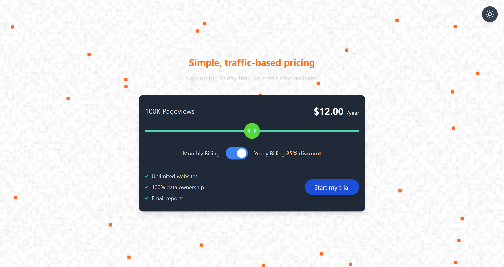
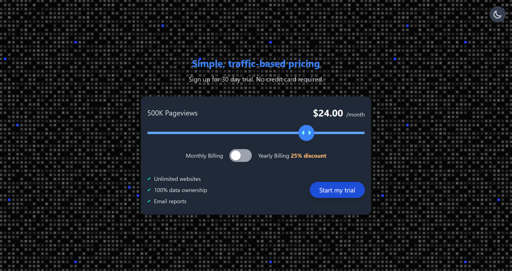

# 🚀 Frontend Mentor - Interactive Pricing Component Solution

This is a solution to the [Interactive pricing component challenge on Frontend Mentor](https://www.frontendmentor.io/challenges/interactive-pricing-component-t0m8PIyY8). Frontend Mentor challenges help you improve your coding skills by building realistic projects.

## 📑 Table of Contents

- [Overview](#overview)
  - [The challenge](#the-challenge)
  - [Screenshot](#screenshot)
  - [Links](#links)
- [My process](#my-process)
  - [Built with](#built-with)
  - [What I learned](#what-i-learned)
  - [Continued development](#continued-development)
  - [Useful resources](#useful-resources)
- [Acknowledgments](#acknowledgments)

## 🧩 Overview

### 🎯 The Challenge

Users should be able to:

- 📱 View the optimal layout for the app depending on their device's screen size  
- 🖱️ See hover states for all interactive elements on the page  
- 🎚️ Use the slider and toggle to see prices for different page view numbers

### 🖼️ Screenshot

### 🔗 Links

- Solution URL: (https://github.com/Triple-P-03/Slider)  
- Live Site URL: (https://pricing-slider-prathmesh.netlify.app/)

## 🛠️ My Process

### 🧪 Built With

- 🧱 Semantic HTML5 markup  
- 🎨 Tailwind CSS  
- ⚙️ Vanilla JavaScript  
- 📐 Responsive design principles  
- 🤖 AI-assisted logic for dark/light mode toggle

### 📘 What I Learned

Switching from traditional CSS to Tailwind CSS was a major step in my frontend workflow. This project helped me get comfortable navigating Tailwind’s documentation and adjusting utility classes to fit component structure. I learned how to break down layout sections and apply styles modularly, improving both speed and consistency.

### 🔄 Continued Development

I’m actively working on deepening my understanding of Tailwind CSS and JavaScript by building components independently. While I used AI assistance for refining the input range slider logic, I aim to reduce reliance and strengthen my own problem-solving skills. Future projects will focus on mastering interactive elements and improving accessibility.

### 📚 Useful Resources

- [Tailwind CSS Documentation](https://v2.tailwindcss.com/docs) – This was my go-to reference for utility classes, layout adjustments, and responsive design patterns throughout the project.

## 🙌 Acknowledgments

Big thanks to my friends Om and Shivam for their encouragement and support throughout this project. Their motivation helped me stay focused and push through the learning curve with confidence.  
